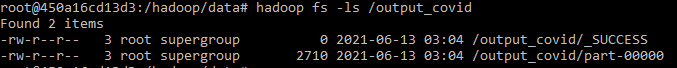
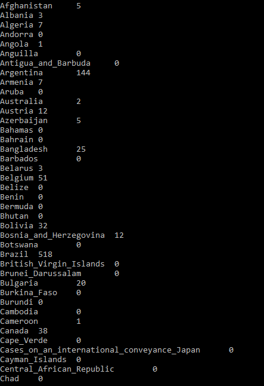
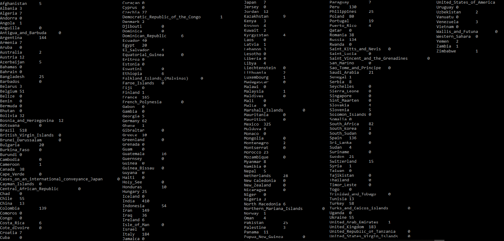

# Creating Map Reduce Job With Java

## Requirements
- Docker
- Java version 8 or higher

## How to Run
- jalankan hadoop env dengan command  `docker-compose up -d`
- matikan hadoop env dengan command  `docker-compose down`

## Running MapReduce Job
- masuk ke datanode system dengan command `docker exec -it datanode bash`
- pindah ke direktori data dengan command `cd /hadoop/data/`
- cek apakah seluruh file di data sesuai dan bisa dieksekusi dengan command `ls -l`
- membuat direktori "projects" yang akan menampung hasil compile MapReduce program `mkdir projects`
- compile MapReduce program dengan command `javac -classpath hadoop-core-1.2.1.jar -d projects MapperCovid.java ReducerCovid.java MeanDeaths.java`
- membuat .jar file agar mudah dieksekusi dengan command `jar -cvf projects.jar -C projects/ .`
- membuat direktori "input_covid" di HDFS dengan command `hadoop fs -mkdir /input_covid`
- simpan data covid csv ke direktori "input_covid" di HDFS dengan command `hadoop fs -put data.csv /input_covid`
- cek apakah data sudah tersimpan di HDFS dengan command `/hadoop/data# hadoop fs -ls -R /`
- running MapReduce program dengan command `hadoop jar projects.jar covid.MeanDeaths /input_covid /output_covid`

## Checking Output Data
- cek output dari MapReduce program dengan command `hadoop fs -ls /output_covid`
#### 
- menampilkan isi output file dengan command `hadoop fs -cat /output_covid/part-00000`
#### 
- menyimpan hasil output ke local system dengan command `hadoop fs -cat /output_covid/part-00000 > aggr_deaths_per_day`

## Sample Output

